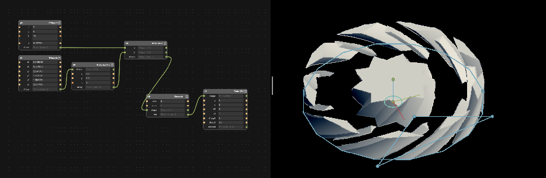
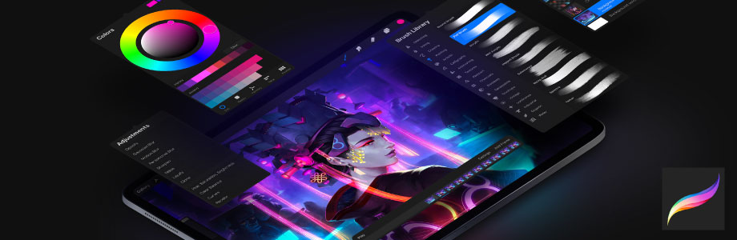
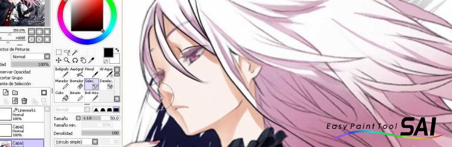

# 

# software-creativo

- [Antimony](https://www.mattkeeter.com/projects/antimony/3/) - Software CAD 3D de modelado modular.
# 
>*[Ejemplo de uso 1](http://archive.fabacademy.org/archives/2016/fablabsantiago/students/391/class2.html) - Ejemplos de Modelado 3D.*  
>*[Ejemplo de uso 2](http://fabacademy.org/archives/2015/as/students/ashman.bry/week2/software_evaluation/) - Ejemplos de producción fractal.*  
>*[Ejemplo de uso 3](http://fabacademy.org/archives/2015/as/students/lee.sungeun/class05.html) - Ejemplos modelado paramétrico e impresión 3D.*  

- [Procreate](https://procreate.art/) - Dibujo digital y análogo.
# 
>*Esta aplicación es exclusiva de apple y está diseñada como una herramienta del ipad + el Apple Pencil. Lo que más destaco es la comodidad de portar el dispositivo con la aplicación como si fuera una croquera en la que puedes dibujar en cualquier momento y en cualquier lugar. Los atajos gestuales son muy útiles y dinámicos para dibujar de la mejor manera con técnicas análogas y digitales. 
>*Procreate está pensado para artistas, ilustradores y diseñadores. Se le puede aprovechar en su mayor potencial con la precisión que otorga el Apple Pencil, un dispositivo extra que entrega una experiencia más real y parecida al dibujo tradicional.
>*[Ejemplo de uso](https://www.youtube.com/watch?v=t5J7hMOS0NM&feature=emb_logo) - Configuración, atajos gestuales y trucos.*  

- [Paint Tool Sai](http://www.mediafire.com/file/8v3b8115orc33m3/Paint_Tool_SAI_%2528bgm94%2529.rar/file) - Dibujo digital y análogo.
# 
>*Este software también es una herramienta para dibujar en tu PC. Es un programa gratuito utilizado por ilustradores japoneses para desarrollo del arte manga. La mejor característica del "Sai" es que tiene una interfaz bastante básica y fácil de aprender. Además pesa muy poco.
>*Es un software totalmente portable en el cual puedes lograr trabajos tan buenos como en photoshop (en cuanto a dibujo y calidad de pinceles).
El potencial del Sai se puede aprovechar de mejor manera con una tableta gráfica. Yo recomiendo utilizar una Wacom u otra que se asemeje a la precisión que tiene en el lápiz.
>*[Ejemplo de uso](https://www.youtube.com/watch?v=F1JzWHDgDfs&feature=emb_logo) - Ilustración digital.*  

- [Zbrush](https://www.zbrushcentral.com/) - Modelación 3D de personajes.
# 
>*Lo genial de Zbrush radica en la modelación 3D con un estilo "escultor". Puedes literalmente esculpir modelos 3D con herramientas intuitivas que te entrega el programa. Si manejas programas de modelado 3D, te será fácil aprender este software, si no conoces mucho este mundo, puedes aprender las herramientas con tutoriales o probándolas paso a paso.
>*Zbrush es una buena herramienta para modelar personajes o cuerpos orgánicos, ese es su fuerte.
>*[Ejemplo de uso](https://www.youtube.com/watch?v=wfO9Htk0qrU&feature=emb_logo) - Esculpido 3d de personajes.*  

- [Enlight Videoleap](http://videoleapapp.com/) - Edición de video portable.
# 
>*Esta aplicación es exluciva de Apple y funciona bastante bien en el ipad y iphone. Es de las mejores que he probado en dispositivos porque tiene las herramientas necesarias que requiere un software de video portable. Si necesitas editar un video con cosas básicas como velocidad, transiciones y calidad de render en un tiempo límite en cualquier lugar, Videoleap es el software indicado.
>*Lo que más me gusta de Videoleap es la interfaz simple que tiene. No tardarás en aprenderte todas las herramientas.
>*[Ejemplo de uso](https://www.youtube.com/watch?v=KpcbO1Cwj28&feature=emb_logo) - Edición de video portable.*

<!---
Referente Ignacio Saavedra
-->

## Link de otros repos

- [Awesome creative coding](https://github.com/terkelg/awesome-creative-coding) - Indice de software creativos.
- [Fabacademy](http://academy.cba.mit.edu/classes/computer_design/index.html) - Listado de software por categorías del Fabacademy 2019.

## Consideraciones
- Las imagenes deben ser subidas en .png, 96dpi máximo, 920x300 px.
- Cada alumno debe subir al menos 4 software con imagen referencial.
- Se debe subir al menos 3 link de ejemplos de uso para cada caso. 
- El taller debe proponer categorías para organizar el listado de software e implementarlo.

<!---
Este es el post completo de cada software.
- [Antimony](https://www.mattkeeter.com/projects/antimony/3/) - Software CAD 3D de modelado modular
# 
>*[Ejemplo de uso 1](http://archive.fabacademy.org/archives/2016/fablabsantiago/students/391/class2.html) - Ejemplos de producción gráfica.*
-->